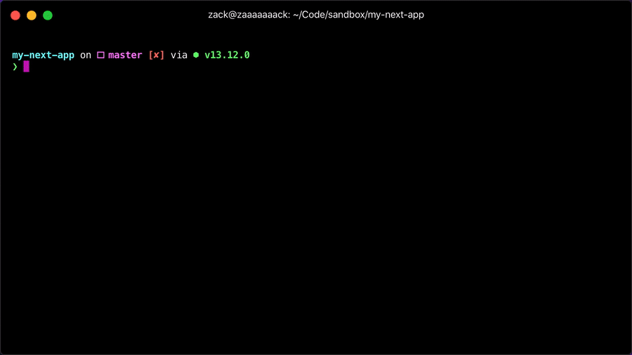

[](https://badge.fury.io/js/next-codegen)

Community-run code generation for [Next.js](https://nextjs.org). Quickly create pages and api routes from the command line.



## Features

- Quickly scaffold page and api routes from the command line
- Supports all Next.js features (dynamic routes, TypeScript, src directory, new data fetching methods, you name it!)
- Super fast and tiny (don't even install if you don't want)

Next-codegen aims to keep in sync with Next.js releases to ensure feature parity. This makes it a great way to keep up with api changes to Next.js. We also link to the wonderful [Next.js documentation](https://nextjs.org/docs/) as much as possible to provide additional help and context.

## Installation

Next-codegen can be used via npx or installed globally. You can install it locally too, whatever works for you.

```shell
> npx next-codegen
> yarn global add next-codegen
> npm i -g next-codegen
```

You can then use `yarn generate` or `npm run generate` to use next-codegen.

## How to use next-codegen

When you run `next-codegen` you'll be asked if you'd like to create a new page or a new api route. Then you'll be asked to name the route. If you're creating a page route, you'll be asked what type of data fetching you'd like to use.

All prompts can be added as commands and flags instead. Here are some examples:

```shell
> next-codegen page about-us
> next-codegen api 'auth/login/[user]'
> next-codegen page 'blog/[category]/[slug]' --ssg
```

So, you can use `next-codegen api` for api routes, `next-codegen page` for pages, and use the `--ssg` (getStaticProps) or `--ssr` (getServerSideProps) flags to specify the data generation type for your page. Pretty neat!

> **TIP**: Most terminals have special treatment for square brackets in arguments, so make sure you wrap any route names in quotes when using the `api` and `page` cli commands. **Don't** add quotes when using the prompts!

## Zero configuration required

Much like Next.js, next-codegen will automatically infer settings from your project. This includes:

- `src` folder detection for `pages/` vs `src/pages/`
- `TypeScript` detection

As next-codegen grows, check here for even more inferred settings and some possible customization in the future.

## Frequently Asked Questions

(Well, nobody's asked them _yet_, but still...)

### Why _another_ custom code generator?

We favor small, specific tools with a single purpose over tools that try to do everything for everyone. By making this code generation tool specific to Next.js we are able to make assumptions about user's projects and avoid a lot of boilerplate and configuration.

[Plop](https://plopjs.com/) is a great code-generation tool that I would highly recommend. However, its [quite large](https://bundlephobia.com/result?p=plop@2.6.0) (1.2mb), which makes it unsuitable for use in a binary tool called with `npx`, which downloads the code on every invocation. We wanted next-codegen to be as easy to use as possible without requiring a lot of custom config or even installing the package.

That being said, plop.js is an excellent tool and you could easily run it alongside next-codegen or write your own Next.js-specific plopfile. Entirely up to you!

### Why doesn't this do [x]?

I'd love it to! Create an issue or pr and I'll take a look. I'd love for next-codegen to be as robust as possible and as customizable as necessary, but with sensible defaults that make sense for most users.

### Who are you?

I'm [@zackkrida](https://github.com/zackkrida), a full-stack remote software engineer who uses Next.js in production every day. I wrote next-codegen for myself to make simple tasks easier, and figured it was worth sharing.

I'm always looking for **part-time and contract remote work**, so feel free to drop me a line at sayhi@zackkrida.com or on twitter [@zackkrida](https://twitter.com/zackkrida)
